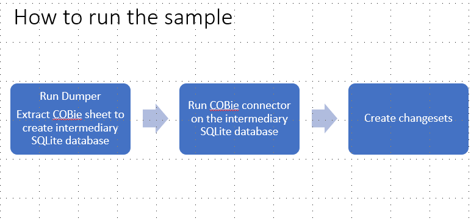

# [COBie](https://en.wikipedia.org/wiki/COBie#:~:text=Construction%20Operations%20Building%20Information%20Exchange,COBie%20was%20designed%20by%20Dr.)

COBie is an international standard for building data exchange. Its most common use is in product data handover from construction to operations. The COBie specifications and guidelines capture industry knowledge and best practices. The COBie standards do not dictate what information is required for a specific project handover. That responsibility still lies with the owner. The COBie data model is a subset (“smart filter”) of the buildingSMART data model, more commonly known as IFC (Industry Foundation Classes). COBie is part of the openBIM movement to collaboratively design, build and operate buildings. It is also part of the UK Building Information Modelling (BIM) Task Group level 2 initiative. The most common representation of COBie is the COBie spreadsheet, but it is important to note that the data format can be represented in multiple ways according to the requirements and needs of the specific data transfer.


## COBie Sample Connector

COBie iModel connector is a component that is capable of reading COBie sheets and incrementally create or update iModels with that data. It has two parts COBie Connector and COBie-extractor.



In the first phase, the COBie-extractor converts the COBie Excel file into an intermediary SQLite database.  To do so please run the provided python script available in this repository. Copy the result to the COBie-connector/src/test/assets directory so that COBie Connector can consume it.
In the second phase, the COBie Connector reads the intermediary SQLite database created by COBie-extractor and creates/updates an iModel from it.

## How to Run It

You may find the sample COBie Excel data under `COBie-extractor/extractor/input/*`. [Sample Data Source](https://www.nibs.org/page/bsa_commonbimfiles)

1. Execute COBie-extractor (see how to inside [COBie-extractor/README.md](../COBie-extractor/README.md))
2. Move the output of COBie extractor (intermediary SQLite DB's) to `COBie-connector/test/assets/`
    - Execute `sh transferdb` on Linux/WSL
3. Run "npm install"
4. Run "npm run build"
5. Run "npm run test:unit". The output [Snapshot iModel](https://www.itwinjs.org/learning/backend/accessingimodels/?term=snapsh#snapshot-imodels) will be at `COBie-connector/test/output/final.db`).
6. Run the connector against a live iModel, run `npm run test:integration`. It will test if the Connector updates the iModel data and schema.
    - The provided Connector tests almost work right out of the box, but you'll need to configure it with your Context, iModel, and OIDC information. To do this, just create a .env file at the project root with the following:

      ```sh
      ###############################################################################
      # This file contains secrets - don't commit or share it!
      ###############################################################################
      TEST_USER_EMAIL=
      TEST_USER_PASSWORD=

      CLIENT_ID=
      CLIENT_REDIRECT_URI=

      # The CONTEXT to create the new iModel.
      CONTEXT_ID=
      ```

      Your CLIENT_ID and CLIENT_REDIRECT_URI should both come from the [iTwin Platform App registration](https://developer.bentley.com/my-apps) - be sure to create a "SPA" app with Visualization enabled!

## Architecture

Mapping of data into requires The COBie connector uses the following parts to map data from the intermediary database into an iModel.

### DataAligner (Reusable Parser)

A DataAligner takes in an ElementTree and always walks down the tree in the same order as [Depth First Search](https://en.wikipedia.org/wiki/Depth-first_search#:~:text=a%20depth%2Dfirst%20search%20starting,%2C%20E%2C%20C%2C%20G.).
It immediately creates the entity it encounters.

### DataFetcher

DataFetcher dynamically joins tables and return values from the intermediary SQLite database.

### EC Schema Generation

COBie Connector creates and imports the entire EC Schema in memory and dynamically generates new EC properties/classes if a new column/table is added to the intermediary SQLite database. The schema of the intermediary database is completely dependent on the schema of the COBie Excel file. Each sheet (tab) in the COBie Excel file and each row is converted into a database table and database row, respectively.

Notes:

1. Referenced EC Schemas must be included in schema/ directory but do not need to be explicitly imported into the iModel.

### Configuration Files

**ElementTree.ts**: a dictionary that dictates the order in which partitions/models/elements should be created/updated.

**COBieElements.ts**: subclasses of EC Elements.

**COBieRelatedElements.ts**: subclasses of EC RelatedElement.

**COBieRelationships.ts**: subclasses of EC relationships.

**COBieSchemaConfig.ts**: configuration for schema mapping.

## Walk-through

Given a COBie Excel file, A,

1. Execute COBie-extractor module to produce an intermediary database, DB_A.
2. Execute COBie-connector module on DB_A
   a. DataFetcher provides an abstraction layer to read data from DB_A
   b. DynamicSchemaGenerator uses DataFetcher to dynamically generate an EC Schema and compares this newly generated EC Schema with the existing EC Schema stored in the current iModel. If the EC Schemas are different, it bumps up the minor version of EC Schema and imports it into the iModel to replace the deprecated schema. 
   c. DataAligner takes in the Schema object generated by DynamicSchemaGenerator and uses the Schema to align all the data fetched from DataFetcher to the iModel. A change detection algorithm is in place to properly update iModel Elements after the first execution of the Connector.
