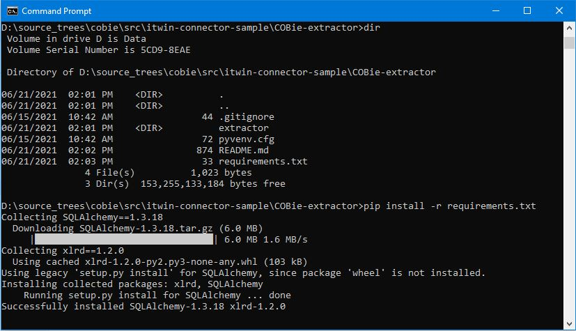
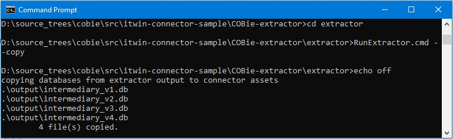

# COBie Extractor

A Python script that dumps COBie Excel data into an intermediary SQLite database consumed by COBie-connector.

## Instructions

1. Requires Python 3 (e.g. 3.9.5) [Python Downloads](https://www.python.org/downloads/)
2. To install dependencies,

        run "pip install -r requirements.txt" 

        

3. Create all intermediary databases

        a. Windows cmd shell: RunExtractorCmd.cmd --all, or ...

        b. Linux / WSL: run "make all"
        c. Other OS: manually run python commands
4. Move the newly created to COBie-connector folder as the input for COBie connector.

        a. Windows: RunExtractorCmd.cmd --copy

        b. Linux / WSL: run "sh transferdb.sh"
        c. Other OS: manually move the intermediary databases to COBie-connector/test/assets/.

## Allowed Schema Changes

1. Add New Column
2. Add New Table
